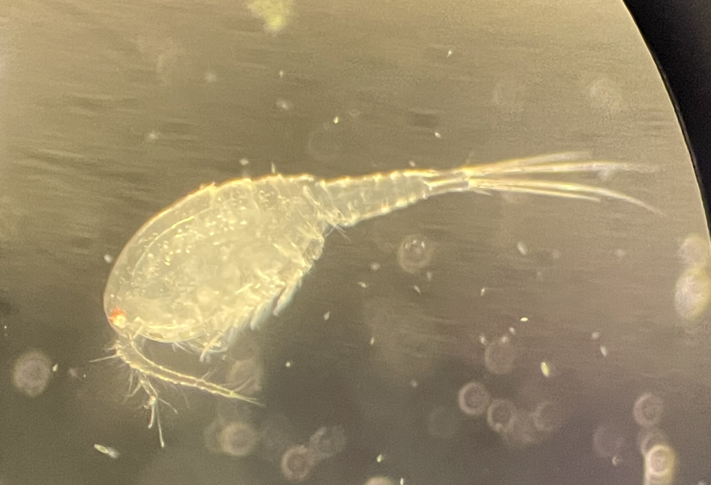

  
  <h2>Emily V. Kerns</h2>
  

--- 

Hi, I'm Emily! I am a PhD candidate studying evolutionary genetics in the [Weber Lab](https://weberlab.integrativebiology.wisc.edu/) at UW-Madison. I am also part of the [Alaska Stickleback Project](https://alaskastickleback.com/), a large eco-evolution and restoration experiment. My dissertation is focused on investigating how phenotypic plasticity is shaped by evolution, and its subsequent impacts on ecology. I use the fish threespine stickleback to study evolved variation in plastic mechanisms, including DNA methylation and transcription. More broadly, I'm interested in understanding population movement (or stagnation) across adaptive landscapes, contemporary evolution, and applying evolutionary biology to modern conservation problems. **I plan to pursue an academic career and am searching for postdocs that begin in September 2026.**

---

# Curriculum Vitae

Last updated April 2026

  <iframe class="pdf-embed" src="./Curriculum Vitae.pdf" frameborder="0"></iframe>

---

# Research Photos

::: {.research-photos style="display: grid; grid-template-columns: repeat(2, 1fr); gap: 10px;"}

:::
:::

---

# Teaching

::: {style="overflow: hidden;"}
{width=25% style="float: left; margin-right: 1.5em; margin-bottom: 0.5em;"}

During my PhD I pursued formal teaching and mentorship training through the Center for Integration of Research, Teaching, & Learning's Delta Teaching Program. In addition to taking specialized courses, I also completed a teaching-as-research project to earn the Delta Teaching & Learning Practitioner Badge. I integrated periodic "utility-value interventions" - activities designed to increase the perceived relevance of course content - into an introductory animal biology lab. I asked if these activities increased students' intrinsic interest in ecology, evolution, and animal biology (EEB). Excitingly, I found that simply completing the course led to higher interest in EEB! Students who completed the intervention were also more likely to pursue EEB-educational activities in their personal life, like watching documentaries or visiting museums. Overall, I was excited to find that integrating a short and easy activity a few times throughout a semester can increase student interest in learning. Importantly, I learned how to integrate research methods into my classroom with the goal of iteratively increasing my efficacy as an instructor.
:::

I was able to put this formal training to practice by being a teaching assistant for three classes across six semesters. During my most recent semester as a TA, five undergraduates approached me for assistance with breaking into academic research. I also mentored 5 undergraduates in the lab, producing one co-first authored paper with my first mentee and including another as a coauthor on one of my thesis chapters.

{width=100%}

---

# Outreach

I served as Outreach Coordinator for two years for the Department of Integrative Biology's Graduate Student Organization. I brought outreach back to the department for the first time since before the Covid pandemic. During my tenure as Outreach Coordinator, 11 graduate student volunteers introduced over 3,600 community members to unfamiliar and misunderstood animals across 5 events.

{width=100%}

{width=70%}

{width=80%}
